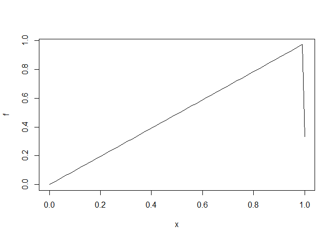

```r
library(Deriv) # Capaz de realizar derivadas e integrais
```

```
## Warning: package 'Deriv' was built under R version 4.2.3
```

```r
library(ggplot2)
```

```
## Warning: package 'ggplot2' was built under R version 4.3.3
```


```r
############################### Define the function
f <- function(x) x**3 + 2*x**2 + x + 1

# Calculate the symbolic derivative
derivada <- Deriv(f, "x")

# Exiba a derivada
derivada
```

```
## function (x) 
## 1 + x * (3 * x + 4)
```

```r
x_vals <- seq(-10, 100, length.out = 500) # Pontos que serão plotados no gráfico!!!!! varia para diferentes funções

# Calcula os valores das funções e derivadas para os valores de x
f_vals <- f(x_vals)
derivada_vals <- eval(derivada(x_vals))

# Valores de X com derivada igual a zero

derivada_em_x <- function(x) eval(derivada(x))
zeros_derivada <- optimize(derivada_em_x, c(-3, 1))
zeros_derivada
```

```
## $minimum
## [1] -0.6666667
## 
## $objective
## [1] -0.3333333
```

```r
#zeros_derivada <- uniroot(derivada_em_x, c(-3, -1))
#zeros_derivada$root

# Cria um dataframe com os valores de x e as funções
dados <- data.frame(x = x_vals, f_x = f_vals, derivada_x = derivada_vals)

# Converta o ponto onde a derivada é zero em um data frame
ponto_derivada_zero <- data.frame(x = zeros_derivada$minimum, y = 0)

# Cria o gráfico usando ggplot2
grafico <- ggplot(dados, aes(x)) +
  geom_line(aes(y = f_x, color = "Função")) +
  geom_line(aes(y = derivada_x, color = "Derivada")) +
  geom_point(data = ponto_derivada_zero, aes(x = x, y = y), color = "green", size = 3) +  
  labs(x = "x", y = "y", color = "Legend") +
  ggtitle("Gráfico da função e sua derivada") +
  scale_color_manual(values = c("Função" = "blue", "Derivada" = "red"),
                     labels = c("Função", "Derivada")) +
  theme_minimal()

# Exibe o gráfico
print(grafico)
```

<!-- -->


