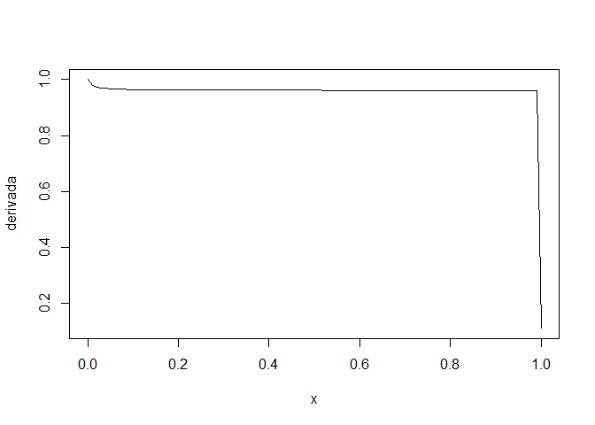

```r
library(Deriv) # Capaz de realizar derivadas e integrais
```

```
## Warning: package 'Deriv' was built under R version 4.2.3
```


```r
# Define the function
f <- function(x) (b*x)/(b+2*x)

# Calculate the symbolic derivative
derivada <- Deriv(f, "x")

# Exiba a derivada
derivada
```

```
## function (x) 
## {
##     .e2 <- 2 * x + b
##     b * (1 - 2 * (x/.e2))/.e2
## }
```

```r
b=seq(1:100)
plot(f)
```

```
## Warning in b * x: comprimento do objeto maior não é múltiplo do comprimento do
## objeto menor
```

```
## Warning in b + 2 * x: comprimento do objeto maior não é múltiplo do comprimento
## do objeto menor
```

<!-- -->

```r
plot(derivada)
```

```
## Warning in 2 * x + b: comprimento do objeto maior não é múltiplo do comprimento
## do objeto menor
```

```
## Warning in b * (1 - 2 * (x/.e2)): comprimento do objeto maior não é múltiplo do
## comprimento do objeto menor
```

<!-- -->

```r
# Derivada para um valor
derivada(2)
```

```
##   [1] 0.0400000 0.1111111 0.1836735 0.2500000 0.3086420 0.3600000 0.4049587
##   [8] 0.4444444 0.4792899 0.5102041 0.5377778 0.5625000 0.5847751 0.6049383
##  [15] 0.6232687 0.6400000 0.6553288 0.6694215 0.6824197 0.6944444 0.7056000
##  [22] 0.7159763 0.7256516 0.7346939 0.7431629 0.7511111 0.7585848 0.7656250
##  [29] 0.7722681 0.7785467 0.7844898 0.7901235 0.7954711 0.8005540 0.8053912
##  [36] 0.8100000 0.8143962 0.8185941 0.8226068 0.8264463 0.8301235 0.8336484
##  [43] 0.8370303 0.8402778 0.8433986 0.8464000 0.8492887 0.8520710 0.8547526
##  [50] 0.8573388 0.8598347 0.8622449 0.8645737 0.8668252 0.8690032 0.8711111
##  [57] 0.8731524 0.8751301 0.8770471 0.8789062 0.8807101 0.8824610 0.8841613
##  [64] 0.8858131 0.8874186 0.8889796 0.8904979 0.8919753 0.8934134 0.8948137
##  [71] 0.8961778 0.8975069 0.8988025 0.9000657 0.9012979 0.9025000 0.9036732
##  [78] 0.9048186 0.9059370 0.9070295 0.9080969 0.9091401 0.9101599 0.9111570
##  [85] 0.9121323 0.9130864 0.9140200 0.9149338 0.9158284 0.9167044 0.9175623
##  [92] 0.9184028 0.9192263 0.9200333 0.9208244 0.9216000 0.9223606 0.9231065
##  [99] 0.9238383 0.9245562
```


