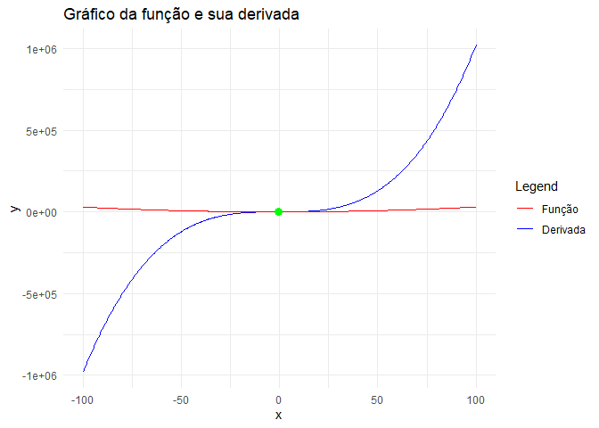

```r
library(Deriv) # Capaz de realizar derivadas e integrais
```

```
## Warning: package 'Deriv' was built under R version 4.2.3
```


```r
# Define the function
f <- function(x) x^2

# Calculate the symbolic derivative
derivada <- Deriv(f, "x")

# Exiba a derivada
derivada
```

```
## function (x) 
## 2 * x
```

```r
plot(derivada)
```

<!-- -->

```r
# Derivada para um valor
derivada(2)
```

```
## [1] 4
```


